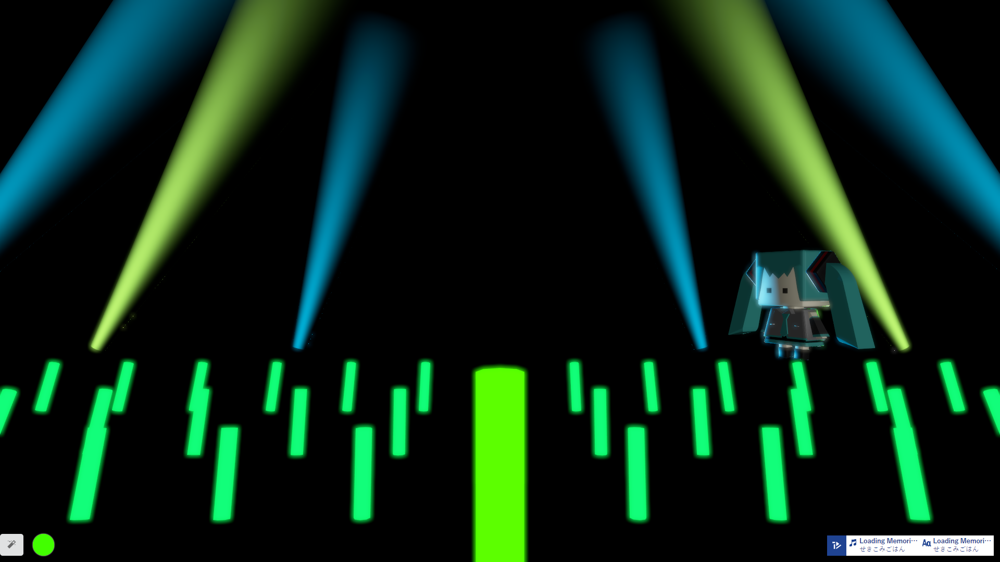
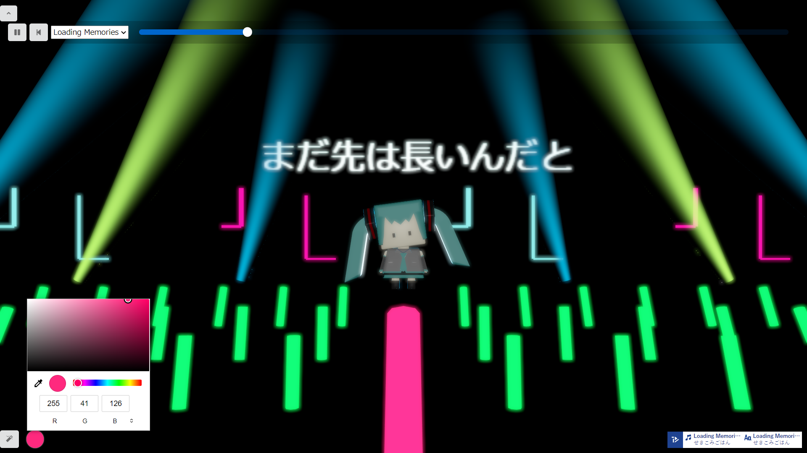

# あなただけのコンサート
## 初音ミク「マジカルミライ」10th Anniversary[プログラミング・コンテスト](https://magicalmirai.com/10th/procon/) 応募作品
いつでもどこでも**あなただけ**のコンサートが楽しめます.
## 内容
このアプリはオンラインライブやLIVEDVDよりもっと気軽に、いつでもどこでもライブを楽しんでいただけます。
中心の下部にある緑の棒付近でカーソルを上下に動かすと会場でペンライトを振っているような気持ちになり、よりライブ感を味わっていただけます。
初音ミクはBlenderで作成しました。表情や動きにご注目ください。

## 操作方法
### 初期画面
 
ローディング後、初音ミクが歩いて登場します。
ミクのスタンバイができ次第、左上にボタンが出現します。


### 再生画面
 
左下のボタンを押すとペンライトがの本数が変わります。
マウスカーソルで前後に操作でき、隣のボタンから色を変えることができます。

## 主要ライブラリ
```
React three fiber
React three drei
TextAlive App API
```
## TextAlive App API

TextAlive App API は、音楽に合わせてタイミングよく歌詞が動くWebアプリケーション（リリックアプリ）を開発できるJavaScript用のライブラリです。
TextAlive App API について詳しくはWebサイト [TextAlive for Developers](https://developer.textalive.jp/) をご覧ください。
## クレジット
-  Miku 3Dmodel : [すず](https://github.com/suzumashi)
- Google Earth Studio : Google

## 注意事項
画像素材の改変，二次配布は固く禁じます.

